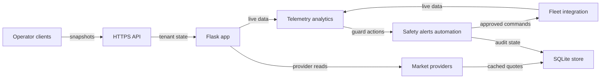

# CYPHER65 War Room — Operator Flyover

> **TL;DR em português:** o CYPHER65 War Room reúne telemetria real de mineração,
> frota ASIC, estatística de bloco, mercado de hashrate e rentals numa instância
> self-hosted. Dados stale ficam marcados; aceitar uma recomendação só registra a
> intenção e abre o módulo correto; qualquer ação real continua atrás dos controles
> do Fleet ou Rentals.

## 0. One-sentence product

CYPHER65 War Room is a self-hosted Bitcoin mining command center that puts live
fleet state, Block Statistics, Scenario Economics, hashrate markets, rentals,
Alerts & Automations, and the AI Operator in one decision surface.

## 1. Context — runtime architecture

The local entry point is `./run.sh`. It starts the Python 3.11+ Flask application,
serves the Vanilla JS dashboard, and uses SQLite as the operational store. The
React Native companion consumes the same API. Local first run uses
`http://localhost:8765`; a remote deployment should terminate TLS and expose the
API over HTTPS.

`Telemetry analytics` covers pool snapshots, worker and ASIC telemetry, block
statistics, and constant-input economic scenarios. `Safety alerts` covers the
SafetyEngine, alert cooldowns, explicit automation rules, and audit decisions.
`Market providers` covers Hash Market and Rentals integrations. See the
[runtime map](architecture/runtime-map.md) for ownership and the advisory flow.
The AI Operator reads the tenant-scoped fleet, market, probability, and metrics
context; it does not bypass the destination module's action guards.

## 2. Problem — operator without a war room

Without a shared operational surface, a miner may keep six disconnected views
open: a pool, NiceHash, MRR, Braiins, mempool, and a spreadsheet.

It is for solo miners, small-farm operators, and rental operators who must make
an operational decision without losing the identity or freshness of its inputs.

- A stale pool hashrate can be mistaken for a live reading.
- A rental overpay can remain hidden until the rental has already run.
- A restart can target the wrong miner when identity and telemetry are split.
- A block mean interval can be misread as a countdown or prediction.
- An “advisory” tool can be unsafe if accepting advice silently executes it.
- A spreadsheet has no tenant boundary, command confirmation, or audit trail.

The problem is not a lack of numbers. It is the loss of source, freshness,
identity, and safety context between those numbers and the next operator action.

## 3. Change — what this PR adds

This PR adds a first-run narrative and one operator map. It does not add a new
dashboard, provider, command, payment path, or synthetic dataset.

The walkthrough follows one sequence: observe real state, compare the relevant
context, accept or ignore advice, then move to the dedicated module if an action
is still justified. A contract test keeps module names and safety statements
aligned with the product.

## 4. How to use it (happy path, 15 minutes)

1. Clone the repository, run `cp .env.example .env`, set `BTC_ADDRESS` and
   `WORKER_NAME`, then start with `./run.sh`.
2. Open `http://localhost:8765` after `/api/healthz` reports ready.
3. Read Overview as a read-only decision surface. Check source, freshness, and
   stale/offline state before interpreting a value.
4. Open AXE Fleet Command. Register and inspect the intended device. Do not send
   a command yet.
5. Open Hash Market. Compare normalized provider entries in BTC/TH/day, their
   source, freshness, and any estimate label; an unavailable provider is not a
   zero-price offer.
6. Open Rentals Hub. Read P/L, cost versus market, concentration, and overpay
   warnings. Do not buy from this walkthrough.
7. Open an Auto-Pilot advisory. Accept means audit plus navigation only:
   `advisory_only: true`, `executed: false`, and `navigate_to` Fleet or Rentals.
8. Only then use the guarded controls in Fleet or Rentals. A physical command
   requires deployment enablement, `dry_run:false`, and the exact one-time human
   confirmation in the destination module.

The detailed command sequence and stop instructions are in the
[15-minute quickstart](OPERATOR_QUICKSTART.md).

## 5. Benefits that are allowed to be claimed

Allowed, because the runtime and tests support them:

- One pane connects fleet, market, probability, and rentals context.
- The last real cached value with a stale/offline badge is better than a blank
  value or an invented number.
- JWT-authenticated tenants are isolated across fleet and operator data.
- An advisory is not execution. Accepting records intent and navigates.
- The operator self-hosts the instance and owns its operational data.
- The mobile companion covers Command, Fleet, Block, Market, Rentals, and AI.

Do not claim:

- “Guaranteed profit”, “you will find a block”, or “beats NiceHash”.
- Invented users, uptime, savings, devices, quotes, or performance.
- “One click restarts the farm from Auto-Pilot”.
- That a statistical mean is a countdown or that prior shares improve the next
  hash probability.

## 6. Implementation care / safety contract

- **Honest telemetry:** no mock prices or production devices. When an external
  source fails, the UI identifies stale/offline data and retains the last real
  cached value instead of inventing a replacement.
- **Advisory boundary:** `POST /api/auto-pilot/recommendations/<id>/respond`
  records an auditable decision. Accept returns `advisory_only: true`,
  `executed: false`, and a `navigate_to` destination. It cannot dispatch a
  command, change a blacklist, or start a purchase.
- **Physical boundary:** commands default to dry-run. Real dispatch requires
  `ENABLE_PHYSICAL_COMMANDS=true`, `dry_run:false`, a supported capability,
  SafetyEngine approval, a short-lived one-time human confirmation, bounded
  adapter handling, idempotency, audit state, and post-command reconciliation.
- **Rental boundary:** blacklist and Braiins buy controls remain in Rentals,
  separate from Auto-Pilot acceptance and behind their own guards.
- **Payment boundary:** PRO checkout is unavailable until BTCPay settlement,
  signed-webhook, duplicate-delivery, and license activation reconciliation is
  verified. The fail-closed response is `checkout_unavailable`; configuration
  alone does not create a PRO purchase CTA.
- **Tenant boundary:** JWT identity scopes fleet, alerts, rentals, settings, and
  exports. Missing or mismatched tenant context fails closed.
- **Data boundary:** operational data remains in the operator's instance and
  SQLite store unless the operator configures an explicit integration.
- **License boundary:** MIT covers the source code. CYPHER65, CYPHER65 WAR ROOM,
  and the ⚡ identity are trademarks of 0xjc65eth.

## 7. Impact

After this PR, an operator or Flyovers viewer can explain what the product is,
start it locally, follow the core decision path, and identify the point where
observation becomes a guarded action without opening twelve other documents.

The intended first conclusion is operational: “I know where to look before I
touch a rig.”
