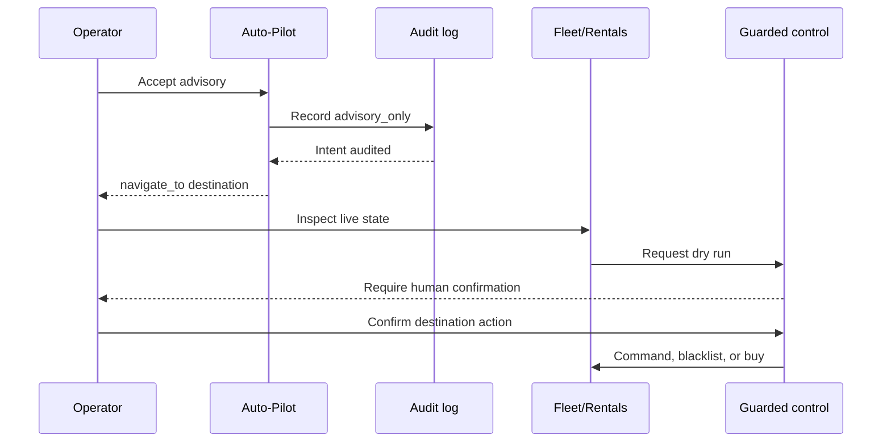

# CYPHER65 War Room — Runtime map

This map names the runtime owners behind the operator walkthrough. It is a
navigation aid, not a second feature catalog.

## Runtime ownership

| Surface | Runtime owner | Data or decision |
| --- | --- | --- |
| Web dashboard | `templates/` + `static/` | Read-only overview and module navigation |
| Mobile companion | `mobile/` | Command, Fleet, Block, Market, Rentals, and AI clients |
| HTTPS API | `app.py` + `routes/` | Authenticated snapshots, reads, and guarded requests |
| Telemetry & analytics | `services/` | Pool, market, probability, economics, and tenant snapshots |
| Safety, alerts, automation | `core/safety/` + `core/alerts/` | Validation, cooldowns, rules, and audit outcomes |
| Device & fleet integration | `axe_fleet/` + `core/adapters/` | Capabilities, telemetry, dry-runs, and confirmed commands |
| Hash Market + Rentals | `services/hashrate_market.py` + `services/rental_performance.py` | Normalized provider data and rental analysis |
| Operational store | SQLite via `DB_PATH` | Tenant state, cached real values, ledgers, and audit state |

The local URL is `http://localhost:8765`. A remote operator client should reach
the same API through an authenticated HTTPS deployment. The operator instance
owns the SQLite data.

## Advisory acceptance is a handoff

The `Accept advisory` step cannot jump to the final arrow. Its response carries
`executed: false`. The operator must inspect the destination and satisfy that
module's current guards. Physical commands need the deployment kill switch,
`dry_run:false`, SafetyEngine approval, and a one-time confirmation. A Rentals
purchase also needs its own confirmation and enabled purchase gates; public
checkout currently fails closed until BTCPay reconciliation.

## Data loop

1. Pollers and adapters collect real provider and miner observations.
2. Services normalize units and attach source and freshness metadata.
3. Snapshot routes scope the response to the authenticated tenant.
4. Web and mobile clients render live, stale, offline, or unavailable state.
5. Alerts and recommendations point to a decision; they do not erase the
   destination module's action boundary.
6. SQLite records tenant state, last real cache, decisions, and command audit.

## Fail-closed edges

- No source response means no invented quote or fleet row.
- No tenant authorization means no cross-tenant operational read.
- No supported capability means no physical command.
- No `ENABLE_PHYSICAL_COMMANDS=true` means dry-run only.
- No one-time confirmation means no physical dispatch.
- No BTCPay reconciliation means `checkout_unavailable` and no purchase CTA.
- MIT grants rights to the code, not the CYPHER65 trademarks or ⚡ identity.
